# SiCenODK

## Saisie de données

### Écran de paramétrage n°1 → l’identité de l’utilisateur

Les champs sont remplis par défaut avec les valeurs saisies dans les paramètres généraux de l’application (voir début de ce tutoriel)

### Écran de paramétrage n°2 → types de géométries créées

- points
- lignes
- polygones

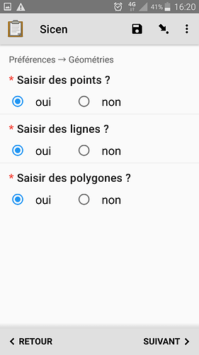

### Écran de paramétrage n°3 → Types de données (thématiques) et paramétrage de l’autocomplétion

La dernière question vous permet de choisir le nombre de caractères à saisir dans le recherche des espèces avant de déclencher l’interrogation du référentiel. 3 est le minimum, 7 le maximum (pour permettre l’utilisation du « code taxon » par exemple « ERI RUB »)

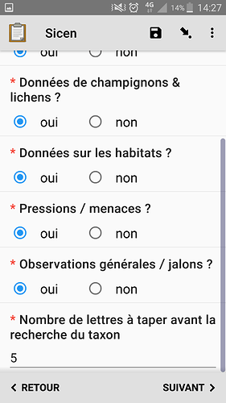

Une fois les paramétrages vérifiés et ou modifiés vous pouvez

### Choisir l’étude

A terme nous aimerions générer dynamiquement et régulièrement cette liste d’études pour ne faire apparaître que les études en cours et pourquoi pas que celles qui concernent l’utilisateur de l’application

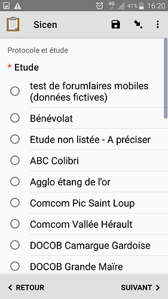

#### Choisir le protocole

Ici aussi, nous devrions pouvoir limiter la liste des protocoles selon l’étude choisie ou l’utilisateur de l’application.

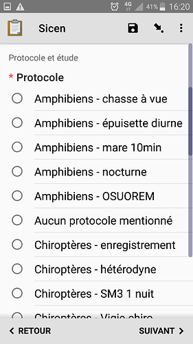

Une fois ces paramètres de « session » renseignés, nous pouvons commencer la saisie de données proprement dite.

### Création d’une localité

Il s’agira d’un point, d’une ligne ou d’un polygone.

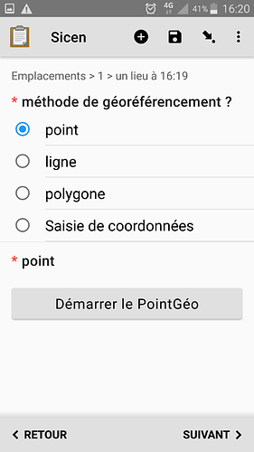

Le GPS peux vous aider à dessiner automatiquement lignes et contours, que vous pouvez aussi dessiner à la main sur l’écran.

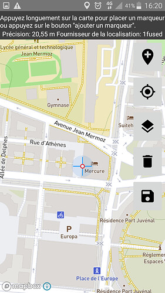

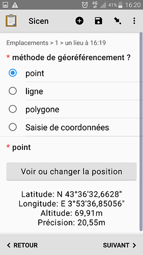

### Saisie d’une ou plusieurs observations à cet endroit

Une fois l’emplacement créé, nous allons pouvoir y créer autant d’observations que nous le souhaitons, de chacun des types d’observations autorisés dans les paramétrages du formulaire.  
« **Pression / menace** » vous permettra de localiser et documenter une pression ou une menace sur le milieu.  
« **Observation générale** » correspond aux jalons que vous connaissez dans Orux Maps, MapInr…, et permet de prendre une photo géolocalisées, que vous pourrez surcharger et commenter.  
Ces observation sont aussi mobilisables dans QGIS.

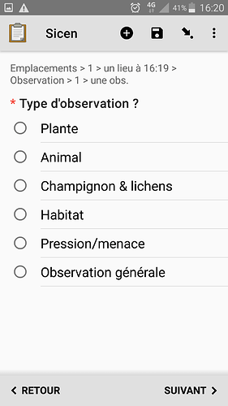

Commençons par une espèce végétale

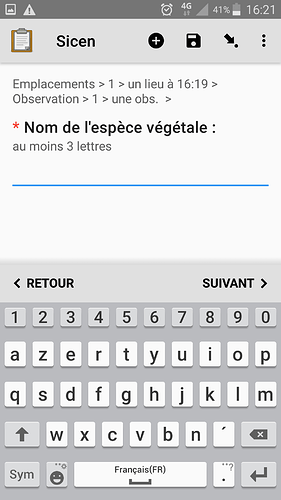

### Propositions des taxons de référence et des synonymes qui correspondent aux lettres tapées

D’abord les taxons de rangs supérieurs puis les espèces et sous espèces.

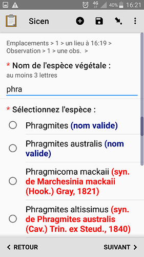

On peut aussi utiliser un code espèce compose ds 3 premières lettres du Genre et des 3 premières de l’espèce et le cas échéant des 3 premières de la sous-espèce :

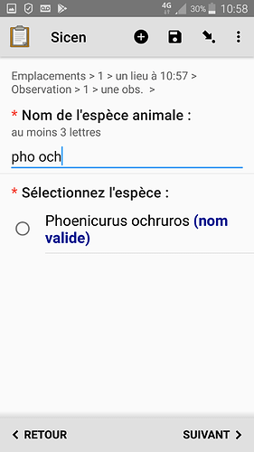

#### Renseignement de l’effectif observé

Pour clarifier la collecte de données d’absence, nous avons ajouté une question explicite :  
Si le taxon n’a pas été vu, c’est qu’il était recherché et absent. Dans ce cas les questions relatives à la saisie de l’effectif ne seront pas affichée.

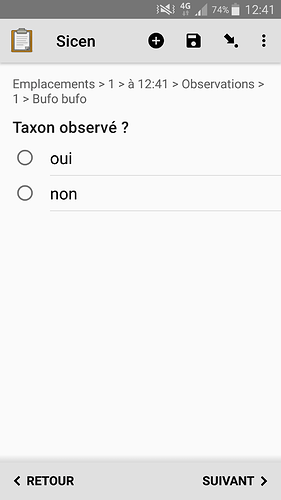

Mais si l’espèce a été observée, les écrans suivant (ou leurs homologues pour la Faune sont affichés)

Ici pour les espèces végétales il s’agit d’un effectif par classes d’abondance

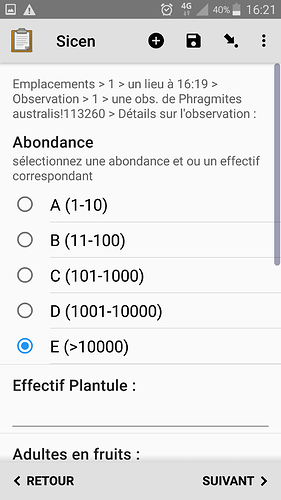

### Informations sur la « qualité » de la donnée

Notez que l’observation pourra être retrouvée dans la navigation du formulaire, avec l’heure de l’emplacement et l’espèce observée.

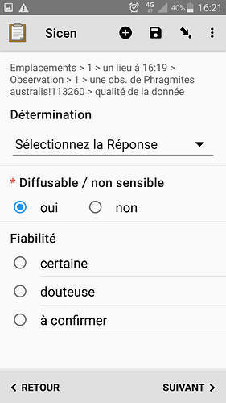

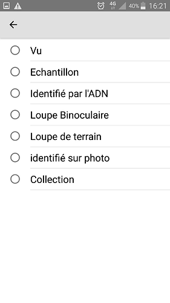

### Renseignement de détails optionnels, prise de photo

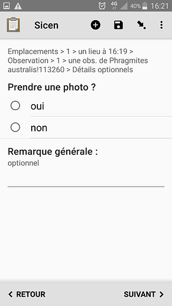

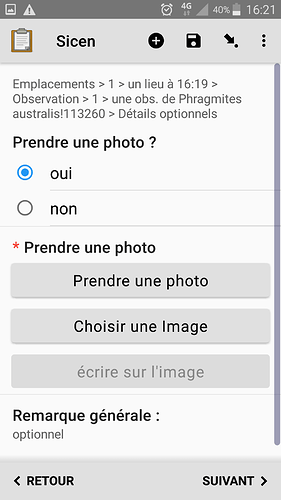

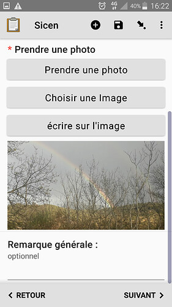

### Annotation de la photo

Cela peut être utile pour les photos de site dans le cas d’observations de type pression/menace  
[Photos mobilisables dans QGIS par la suite](https://si.cen-occitanie.org/?p=191)

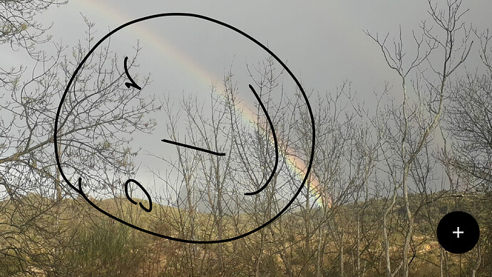

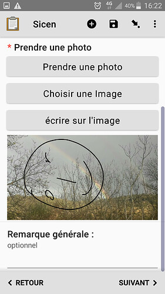

### ajout d’une observation

Si oui on revient à la saisie d’une observation sur l’emplacement courant.

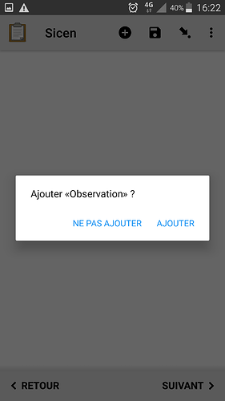

Si non il nous est proposé d’ajouter une nouvelle localité

Si oui on revient à l’ajout d’une localité (point, ligne ou polygone)  
Si non, on finalise le formualire en renseignant la présence d’éventuels accompagnateurs

### Renseignement des accompagnateurs éventuels

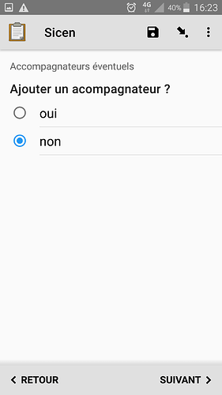

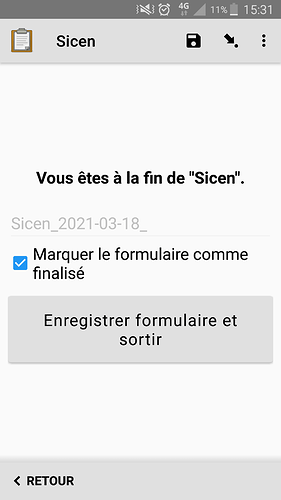

### Modification / révision éventuelle des données saisies

**Au fur et à mesure de la saisie, n’hésitez pas à utiliser l’icône de la disquette pour enregistrer le formulaire en cours sur votre téléphone.**  
L’icône représentant une flèche montrant un point permet de naviguer dans les observations déjà saisie pour les vérifier ou les modifier.

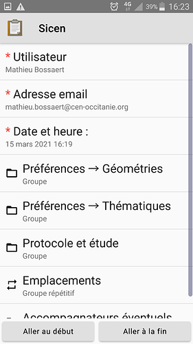

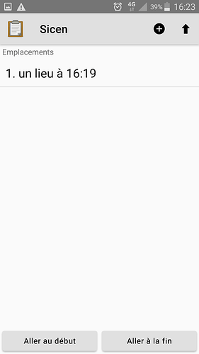

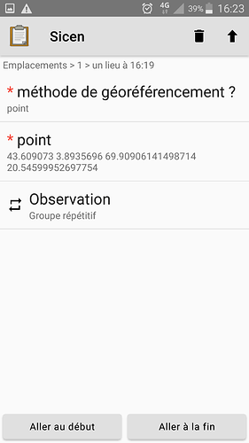

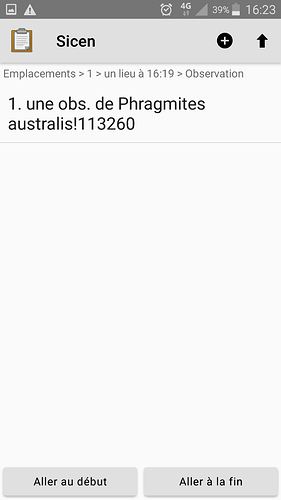

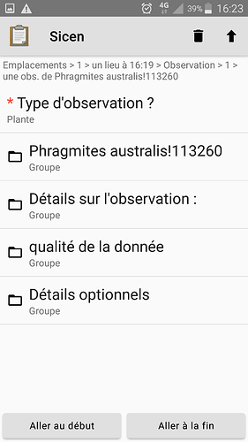

Une fois ceci fait on peut aller au bout du formulaire et le marquer comme finalisé.

### Finalisation du formulaire

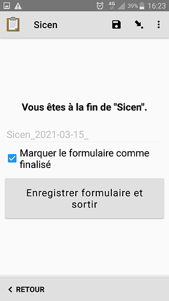]

## Améliorations apportées pour la saison 2022

- taxref v15 avec un élargissement des statuts biogéographies utilisés
- ajout du déterminateur (par défaut l’observateur)
- ajout par défaut de la valeur ‹ Vu › à la question « détermination »
- possibilité de créer une observation de type « station »
- possibilité de ne pas repasser sur ses préférences pour ne pas voir ces deux écrans au démarrage
- possibilité d’ajouter un nouveau site/étude/protocole si celui qu’il vous faut n’est pas listé.
