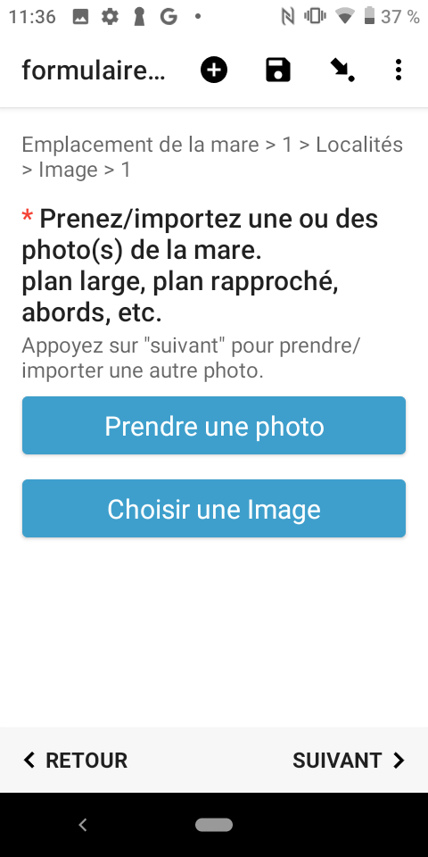

Voila la description précise du formulaire réalisée par Liza ;-) :

# Nom du formulaire : Formulaire PRAM (inventaire et suivi de mares)

## Description : formulaire d'inventaire et suivi des mares d'Occitanie

### Auteur(s)

-> Formulaire développé par Liza Jabbour au CEN Occitanie dans le cadre de sa formation au sein du Master 2 SIGMA (ENSAT – INP)

### Objectif

Dans le cadre du projet PRAM, le CEN Occitanie a décidé de mettre en place des outils de saisie et de suivi des mares d’Occitanie en lien avec les PRAM d’autres régions. Ce formulaire permet de saisir des fiches descriptives de mares que ce soit dans une plateforme web ou sur un terminal mobile (ODK). Ces fiches seront ensuite consultables depuis l’application web du PRAM CEN Occitanie.

-> Lien vers le formulaire
-> Lien vers l’application PRAM du CEN Occitanie

#### Protocole mis en œuvre

-> lien vers le pdf ou autre ressource

## Logique du formulaire

- Sélection de l’étude/protocole
- Sélection de la structure 
- Géolocalisation de la mare
- Sélection du type de foncier 
- Description de la nature du fond de la mare
- Sélection du pourcentage des pentes douces des berges
- Sélection de la typologie de la mare
- Description du contexte général de la mare
- Description du contexte précis de la mare
    - Option de protection de la biodiversité
- élection de la périodicité de la mare
- Sélection des différents stades d’évolution de la mare 
- Sélection des différents types de liaison hydrologique
- Sélection des différents types d’alimentation en eau
- Superficie en m2
- Profondeur en m
- Turbidité de l’eau
- Couleur de l’eau 
- Analyses physico-chimique
    - Ph de l’eau
    - Température de l’eau
    - Oxygène dissout
    - Conductivité de l’eau
    - Productivité de l’eau
- Les pressions et menaces
- Intensité des pressions et menaces
- Types de végétations aquatiques
    - Taux de recouvrement de la végétation aquatique
- Gestion et restauration
- Fermeture de la mare
- Accessibilité de la mare
- Type de véhicule
- Photos de la mare
- Observations générales

## Présentation détaillée

### Écran n°1 : page d'accueil du formulaire

Le premier écran présente le formulaire dans le cadre du projet PRAM avec son logo officiel et une courte description des informations que vous pouvez renseigner.

### Écran n°2 : identité et date
                     
Le deuxième écran reprend vos informations d'identité, renseignées lors de l'initialisation de l'appareil, et vous présente la date du jour.

**L'adresse email doit bien être renseignée en minuscules (attention notamment à la première lettre que les correcteurs automatiques ont tendance à mettre en majuscule).**

### Écran n°3 : Choix de l'étude/protocole

L'écran suivant vous propose de choisir votre étude/protocole dans la liste suivante. 

### Écran n°4 : Choix de l'étude/protocole - Autre

Si vous cochez *"autre"*, vous serez rediriger sur une autre page pour indiquer l'étude/protocole qui correspond.

### Écran n°5 : Choix de la structure
L'écran suivant vous propose de choisir votre structure dans la liste suivante. Si vous cochez *"autre"*, vous serez rediriger sur une autre page pour indiquer la structure qui correspond.

### Écran n°6 : Géoréférencement

Sur cet écran, vous pouvez choisir la méthode de géoréférencement qui vous convient parmi trois choix : *point*, *polygone*, *saisie de coordonnées*. Une fois la méthode 1 ou 2 cochée, appuyez sur le gros bouton bleu *Démarrer le PointGéo*. Cette action vous dirige vers la carte.

### Écran n°7 : Fond de carte

Sur cet écran, vous pouvez pointer votre mare ou dessiner votre polygone représentant les contours de votre mare sur la carte. Pour pointer, il suffit d’appuyer longuement sur la carte pour que votre point apparaisse. N'oubliez pas de sauvegarder votre point ou polygone en appuyant sur le logo "disquette" situé en bas à droite de votre écran. 

### Écran n°8 : Confirmation de votre géoréférencement

Vous êtes redirigez vers la page de méthode de géoréférencement. En bas de votre écran, vous verrez les coordonnées géographique de votre point ou polygone. Vérifiez bien vos coordonnées. Changez la position de votre point si besoin en appuyant sur le gros bouton bleu *Voir ou changer la position*.

'

### Écran n°9 : Foncier

Cette page vous ropose les différent statut foncier de la mare. Choisissez un statut. Vous serez automatiquement redirigez vers la page suivante.

### Écran n°10 : Nature du fond de la mare

Cette page vous propose les différents type de nature du fond de la mare. 

### Écran n°11 : Nature du fond de la mare - Autre

Il vous est possible de renseigner d'autres types en sélectionnant *autres*. Vous serez redirigez vers une page où vous pourrez renseigner l'information souhaitée. 

### Écran n°12 : Pourcentage des pentes douces des berges

Sur cet écran, vous devez renseigner le pourcentage des pentes douces des berges inférieur à 30%.

### Écran n°12 : Typologie de la mare

Sur le Xème écran, vous devez renseigner la typologie de la mare. Vous avez la possibilité" d'en sélectionner une ou deux. 

### Écran n°13 : Contexte général

Sur cet écran, il vous est demandez de renseigner le contexte général de la mare. Vous avez le choix entre 6 choix. Vous pouvez en choisi 2 maximum. La dernière option est de renseigner vous même le contexte général en appuyant sur *Autre*. Comme pour les questions précédentes, vous serez redirigé automatiquement vers une nouvelle page.

### Écran n°14 : Contexte général - Autre

 Ici aussi, il vous est demandez de renseigner le contexte général de la mare n'étant pas dans la liste.

### Écran n°15 : Contexte précis
 
 Ici aussi, il vous est demandez de renseigner le contexte précis de la mare. Vous pouvez en choisi 2 maximum.

### Écran n°16 : Contexte précis - Autre

AMELIORATION A VENIR !

 Ici aussi, il vous est demandez de renseigner le contexte précis de la mare n'étant pas dans la liste.
 
 

### Écran n°17 : usages de la mare

Ici aussi, il vous est demandez de renseigner l'usage de la mare

### Écran n°18 : usages de la mare - Protection de la biodiversité

Lorsque vous renseignez l'option usages de la mare "protection de la biodiversité", vous serez redirigé vers deux autres questions, chacune sur une page.

### Écran n°19 : usages de la mare - Protection de la biodiversité - IAE ?

Sur cet écran, il vous est demandez de répondre à la question ci-dessous. Cette question dépend de la catégorie "contexte précis". Si vous n'avez pas coché l'option "protection  de la biodiversité", elle ne s'affichera pas. 

### Écran n°20 : Contexte précis - Protection de la biodiversité - Mare de compensation ? 

Idem sur cet écran, il vous est demandez de répondre à la question ci-dessous. Cette question dépend de la catégorie "contexte précis". Si vous n'avez pas coché l'option "protection  de la biodiversité", elle ne s'affichera pas.

### Écran n°21 : Périodicité de la mare

Cette page vous propose de sélectionner si la mare est permanente, temporaire ou bien si vous ne savez pas, vous pouvez cocher "indéterminé".

### Écran n°22 : Stade d'évolution de la mare

Cette page vous propose de sélectionner le stade d'évolution correspondant à votre mare. Des illustrations avec descriptions sont là pour vous orienter. 

### Écran n°23 : Type de liaison hydrologique

Ici, il vous est demandez de choisir un seul type de liaison hydrologique.

### Écran n°24 : Type d'alimentation en eau

Ici, il vous est demandez de choisir un seul type d'alimentation en eau.

### Écran n°25 : Superficie en m2

Ici, il vous est demandez de renseigner la superficie en m2. Il faut choisir l'intervalle correspondant.

### Écran n°26 : Profondeur en m

AMÉLIORATION FORMULAIRE A VENIR !
Ici, il vous est demandez de renseigner la profondeur en m.

### Écran n°27 : Turbidité de l'eau

Sur cet écran, vous devez renseigner la turbidité de l'eau. Choisissez la réponse la plus adapté à votre mare. 

### Écran n°28 : Couleur de l'eau

Sur cet écran, vous devez renseigner la couleur de l'eau. Choisissez la réponse la plus adapté à votre mare. 

### Écran n°29 : Analyses physico-chimiques (APC)

Ici, on vous demande si vous souhaitez renseigner des données d'analyses physico-chimiques. Si vous répondez *oui*, suivez la suite de ce guide. Si vous répondez *non*, vous pouvez passer directement à l'écran n°36. 

### Écran n°30 : (APC) Ph de l'eau

### Écran n°31 : (APC) Température de l'eau

### Écran n°32 : (APC) Oxygène dissous - type de mesure

Renseignez tout d'abord le type de mesure prise pour l'oxygène dissous, soit mg/L, soit en %.

### Écran n°33 : (APC) Oxygène dissous - valeur mesure

Renseignez ensuite la valeur obtenue.

### Écran n°34 : (APC) Conductivité de l'eau

### Écran n°35 : (APC) Productivité de l'eau

### Écran n°36 : Pressions et menaces

Si vous avez répondu non à la question précédente "souhaitez-vous renseigner des données physico-chimiques ?" vous serez redirigé directement sur cet écran. Ici, il vous est demandez de renseigner les pressions menaces que vous observez sur votre mare. Vous pouvez en sélectionner 6 maximum.

### Écran n°37 : Intensité des pressions et menaces

Il vous est demandez par la suite de renseigner l'intensité moyenne des pressions et menaces sélectionnées. 

### Écran n°38 : Type de végétation aquatique (RVA)

Sur cet écran, renseignez un type de végétations aquatiques/de recouvrement de la mare. Une fois renseignez, vous êtes dirigez vers l'écran suivant qui vous demande de renseigner le pourcentage de recouvrement de la mare par le type de végétation sélectionné juste avant. 

 
### Écran n°39 : (RVA) Pourcentage de recouvrement
renseignez le pourcentage de recouvrement de la mare par le type de végétation séléctionné juste avant.

### Écran n°40 : (RVA) Ajouter un type de végétation aquatique ? 

Voulez-vous rajouter un autre type de végétations aquatiques ? 
Vous pouvez répéter ce processus autant de fois qu'il est nécessaire. Une fois toutes les informations renseignées, vous pouvez appuyer sur *"Na pas ajouter"*. Vous passerez à la suite du formulaire. 

### Écran n°41 : Gestion et restauration

Renseignez ici le(s) type(s) de gestion/restauration possible. 6 choix maximum.

### Écran n°42 : Gestion et restauration - Restaurer/réhabiliter

Si vous sélectionnez l'option *"Restaurer/réhabiliter"*, il vous est demandez de préciser l'action souhaitée parmi une liste de choix. 

### Écran n°43 : Gestion et restauration - Autre

Si vous séléctionnez l'option *"Autre"*, il vous est demandez de préciser l'action souhaitée le plus court possible.

### Écran n°44 : Fermeture de la mare

Renseignez ici le pourcentage de fermeture de la mare dû à l'emboisement/embroussaillement des abords.

### Écran n°45 : Accessibilité de la mare 

### Écran n°46 : Type de véhicule

Si vous avez renseignez précédemment que la mare est accessible, choisissez le type de véhicule pouvant circuler jusqu'à la mare.

### Écran n°47 : Photos 

Prenez ou importez des photos de la mare. Ici, il vous est demandez de mettre des photos avec un plan général de la mare, puis un plan plus rapproché, etc. 
Vous ne pouvez que sélectionner une photo à la fois. L'écran suivant vous proposera de rajouter si nécessaire une autre photo. 

### Écran n°48 : Ajouter une photo

### Écran n°49 : Observations générales

Renseignez les informations complémentaires que le formulaire n'aurait pas couvert. 

### Écran n°50 : Ajouter un emplacement 

Souhaitez-vous renseigner une nouvelle mare ? Si oui, vous serez redirigé sur un autre formulaire PRAM vierge. 

### Écran n°51 : Fin du formulaire

Vous êtes à la fin du formulaire, bravo ! Merci de votre participation !

### Logique de collecte

### Déployer le formulaire

## Lien vers XLSform

## Lien vers données externes et médias associés

## Traitement des données

### Scripts SQL

### Scripts R

### Autres
