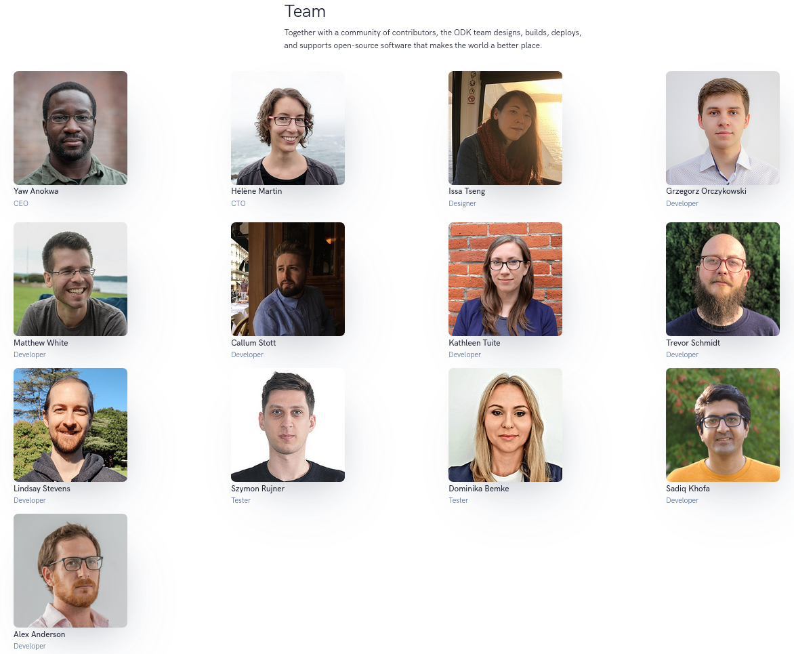
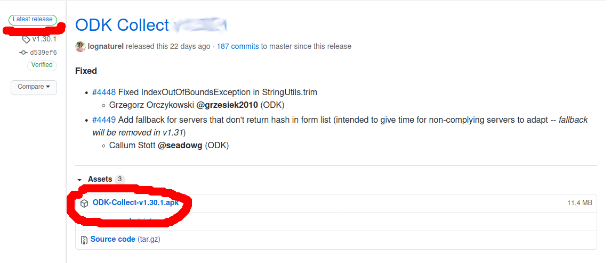
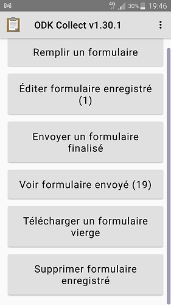
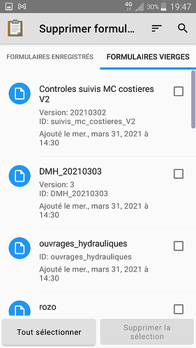
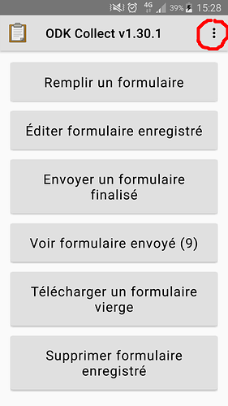
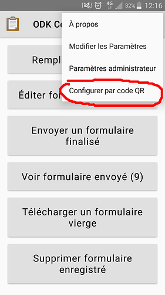
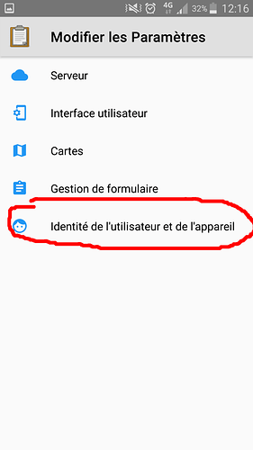
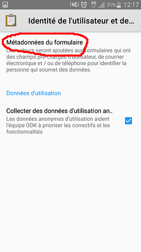
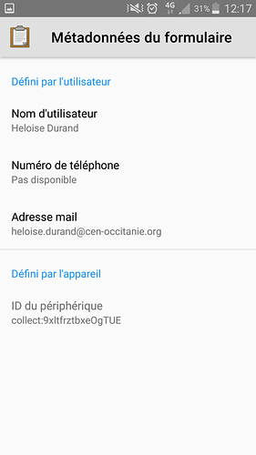
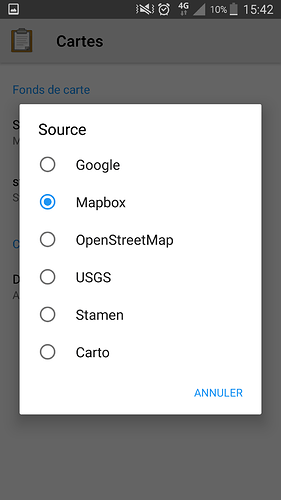

# ODK - Open Data Kit

## Présentation de l'outil

## Présentation de l'équipe

## Quelques présentations réalisées au sujet d'ODK au CEN

* https://static.geotribu.fr/articles/2021/2021-06-08_odk_postgis_1/
* https://si.cen-occitanie.org/opendatakit_au_foss4g-fr_2018/
* https://si.cen-occitanie.org/wp-content/uploads/2022/06/CEN_Occitanie_SI_PostGIS_ODK.pdf

## Installation et configuration d’ODK Collect

### Installation

Depuis le « playstore » d’Android ou depuis le fichier .apk mis à disposition sur le site du projet : [Release ODK Collect v2022.2.1 · getodk/collect · GitHub 8](https://github.com/getodk/collect/releases/latest)

Un fois téléchargé sur le téléphone (n’importe où), vous cliquez sur le fichier apk pour lancer l’installation. Android mettra tout au bon endroit. Vous pourrez ensuite supprimer le fichier .apk.

 8](https://github.com/getodk/collect/releases/latest)

### Configuration de l’application

\*\*Important : \*\*  
pour éviter des conflits avec les formulaires vierges déjà enregistrés sur le téléphone et des soucis d’envoi de données.  
Commencez par supprimer les formulaires vierges existants d’ODK avant de le configurer

#### Cliquer sur « supprimer formulaire enregistré »

#### Dans l’onglet « Formulaires vierges » , Sélectionnez tout et supprimez

Tout d’abord, la connexion au serveur de formulaires (nommé Central) se fait par le scan d’un QRcode.  
Vous avez deux possibilités (et deux QRCode au choix):

- soit ODK Collect gère automatiquement
  - le téléchargement des nouvelles formulaires disponibles (tous)
  - de leurs nouvelles versions
  - l’envoi des données des formulaires finalisés au serveur
- soit vous faites cela à la demande
  - télécharger les formulaires qui vous intéressent
  - télécharger les nouvelles versions
  - envoi des données au serveur

#### Paramètres

#### Configurer par QRCode

Une fois le code scanné, votre application est configurée et interroge le serveur pour savoir quels formulaires sont disponibles, et les télécharge.

#### Identité de l’utilisateur

Il nous faut maintenant renseigner les données d’identification qui permettront de vous faire connaître une fois pour toutes dans les différents formulaires et de vous attribuer correctement vos données.

→ Veillez à renseigner l’adresse mail (_**!!! votre adresse professionnelle en minuscules !!!**_).

#### Cartes → Choisir Mapbox

#### Autres paramètres utiles

De retour sur l’écran des paramètres, vous pourrez modifier :

- la taille de la police qui sera utilisée dans les formulaires
- la manière de naviguer d’un écran à l’autre
  - en faisant glisser le doigt sur l’écran de gauche à droite pour avancer et de droite à gauche pour reculer
  - en affichant des boutons en bas de l’écran
  - en utilisant les deux méthodes

Vous êtes maintenant prêts à saisir votre premier formulaire.  
ODKCollect est configuré pour proposer systématiquement les dernières versions des formulaires disponibles sur le serveur.